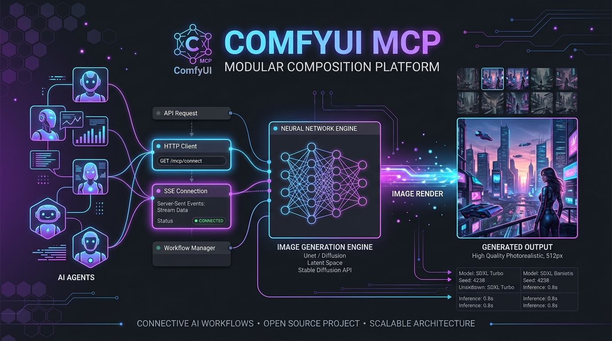

# comfyui-mcp

[](https://www.python.org/)
[](https://opensource.org/licenses/MIT)
[](https://modelcontextprotocol.io/)
[](https://github.com/jlowin/fastmcp)
[](https://github.com/GermaniU/comfyui-mcp)

<p align="center">
  
</p>

**Professional MCP HTTP/SSE server for image generation using ComfyUI (SDXL / RTX 3060).**

`comfyui-mcp` acts as a decoupled middleware adapter that exposes ComfyUI inference capabilities to any client or gateway supporting the **Model Context Protocol (MCP)** across the local network, without requiring local PyTorch environments or heavy model downloads on client machines.

[Spanish Version (README.md)](README.md) | [Architecture](docs/ARCHITECTURE.md) | [Backend Server Setup](docs/SERVER_SETUP.md)

---

## ⚡ Key Features

- 🎨 **txt2img & img2img Generation**: Native support for SDXL prompts with programmatic configuration of aspect ratios, sampling steps, denoising, and random seeds.
- 🎯 **Optimized Presets**: Pre-configured profiles tailored for common use cases (`producto`, `realista`, `rapido`, `anime`).
- 🧠 **GPU Arbiter (VRAM Switching)**: Automatic VRAM coordination with LLM servers (`llama-server`) via systemd to maximize 12GB GPU utilization.
- 🌐 **Decoupled HTTP/SSE Transport**: Exposes MCP tools over HTTP on port `8201`, allowing macOS, Linux, or Windows clients to consume image generation capabilities seamlessly.
- 🖼️ **Direct Image Delivery**: Resolves public/LAN URLs for immediate client downloading without shared file systems.
- 🔍 **Health Monitoring & Model Discovery**: Inspect GPU VRAM utilization, execution queue, available checkpoints, and LoRAs.

---

## 🏗️ Architecture & Component Boundaries

> ⚠️ **IMPORTANT: System Boundaries**
>
> `comfyui-mcp` is **strictly the MCP transport & interface layer**. It does NOT include the ComfyUI inference engine or large model weight files.
> For host server deployment instructions, see [docs/SERVER_SETUP.md](docs/SERVER_SETUP.md).

```
 +-------------------------------------------------------+
 |                 MCP Clients (LAN)                     |
 | (Claude Code CLI / Cursor / Windsurf / Hermes Gateway)|
 +-------------------------------------------------------+
                             |
                             | HTTP / SSE (Port 8201)
                             v
 +-------------------------------------------------------+
 |                  comfyui-mcp Server                   |
 |           (FastMCP + Workflow JSON Builder)           |
 +-------------------------------------------------------+
                             |
                             | Loopback HTTP (Port 8188)
                             v
 +-------------------------------------------------------+
 |                 ComfyUI Backend Host                  |
 |  (PyTorch + CUDA + SDXL Checkpoints + GPU Arbiter)    |
 +-------------------------------------------------------+
```

---

## 📦 Quickstart

### Prerequisites
- Python 3.11+
- `uv` (recommended) or `pip`

### Install

```bash
git clone https://github.com/GermaniU/comfyui-mcp.git
cd comfyui-mcp

# Create venv and install
uv venv
source .venv/bin/activate
uv pip install -e .
```

---

## ⚙️ Configuration (Environment Variables)

Create a `.env` file or export environment variables:

| Variable | Default | Description |
|----------|---------|-------------|
| `COMFYUI_URL` | `http://127.0.0.1:8188` | Loopback URL where the host ComfyUI engine is listening. |
| `COMFYUI_PUBLIC_URL` | `http://192.168.68.108:8188` | Public/LAN base URL for direct client image downloads. |
| `MCP_HOST` | `0.0.0.0` | Host binding for the MCP server. |
| `MCP_PORT` | `8201` | HTTP/SSE port for the MCP server. |

---

## 🛠️ MCP Tool Reference

### 1. `generate_image` (txt2img)
Generates an image from a text prompt using SDXL.

- **Parameters**:
  - `prompt` (*string*, required): Detailed description of the image to generate.
  - `negative_prompt` (*string*, optional): Concepts to exclude. Default: `"ugly, blurry, low quality, distorted"`.
  - `preset` (*string*, optional): Preset profile (`producto`, `realista`, `rapido`, `anime`). Default: `"realista"`.
  - `aspect_ratio` (*string*, optional): Target aspect ratio (`1:1`, `16:9`, `9:16`, `4:3`, `3:4`). Default: `"1:1"`.
  - `seed` (*integer*, optional): Random seed (-1 for random). Default: `-1`.
  - `steps` (*integer*, optional): Sampler steps (overrides preset default).
  - `cfg` (*float*, optional): CFG scale.

### 2. `img2img`
Transforms an existing image using a new prompt and denoise strength.

- **Parameters**:
  - `image_source` (*string*, required): Public URL or Base64 string of input image.
  - `prompt` (*string*, required): Transformation instruction.
  - `denoise` (*float*, optional): Denoising strength (`0.1` to `1.0`). Default: `0.7`.
  - `preset` (*string*, optional): Preset checkpoint/sampler profile. Default: `"realista"`.

### 3. `list_models`
Returns available checkpoints, LoRAs, and samplers installed on the ComfyUI instance.

### 4. `comfy_health`
Retrieves backend engine health: ComfyUI version, GPU VRAM usage, and queue length.

### 5. `comfy_view_url`
Constructs the direct LAN download URL for a generated image given its `filename` and `subfolder`.

---

## 🎨 Preset Matrix

| Preset | Associated Checkpoint | Steps | CFG | Primary Use Case |
|--------|----------------------|-------|-----|------------------|
| `producto` | `RealVisXL_V4.0.safetensors` | 30 | 7.0 | Photorealistic product & commercial photography. |
| `realista` | `juggernautXL_ragnarokBy.safetensors` | 30 | 7.0 | High quality general photorealism (Default). |
| `rapido` | `juggernautXL_ragnarokBy.safetensors` | 6 | 2.0 | Draft previews in ~5 seconds. |
| `anime` | `animagine-xl-3.1.safetensors` | 28 | 7.0 | Digital illustration and anime styles. |

---

## 🔗 Client Integration Guides

### Claude Code CLI (`~/.claude.json`)

```json
{
  "mcpServers": {
    "comfyui": {
      "url": "http://192.168.68.108:8201/mcp"
    }
  }
}
```

### Hermes Gateway (`~/.hermes/config.yaml`)

```yaml
mcp_servers:
  comfyui:
    url: "http://192.168.68.108:8201/mcp"
    transport: "http"
```

---

## 🧪 Running Tests

```bash
uv run --with pytest --with pytest-asyncio pytest
```

---

## 📄 License

This project is licensed under the MIT License. See [LICENSE](LICENSE) for details.
