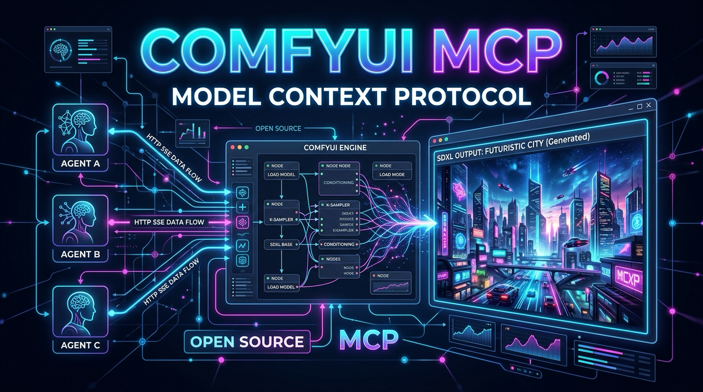

<p align="center">
  
</p>

**English** · [Español](README.md)

# ComfyUI MCP — Image Generation for AI Agents via Model Context Protocol (MCP)

> **Connect SDXL image generation capabilities to any AI agent on your network.**
> Open-source MCP server exposing ComfyUI inference (SDXL / RTX 3060) to Claude Code, Cursor, Windsurf, Hermes Gateway, and any client compatible with [Model Context Protocol](https://modelcontextprotocol.io). FastMCP HTTP/SSE + GPU Arbiter, **zero client dependencies, 100% on your hardware**.

[](LICENSE)
[](https://modelcontextprotocol.io)
[](pyproject.toml)
[](https://github.com/GermaniU/comfyui-mcp/actions/workflows/ci.yml)
[](https://github.com/jlowin/fastmcp)
[](CONTRIBUTING.md)

**Tags:** `mcp-server` · `comfyui` · `sdxl` · `image-generation` · `ai-agents` · `fastmcp` · `claude-code` · `cursor` · `hermes-gateway` · `gpu-arbiter` · `local-first` · `self-hosted`

---

## 💡 Why It Exists

Generating images in multi-agent environments usually requires installing heavy PyTorch dependencies, dedicated GPUs, and complex setups on every client machine. **ComfyUI MCP** solves this by acting as a decoupled HTTP/SSE middleware adapter:

- 🚀 **Zero Local Installation**: Any client or gateway consumes image generation over HTTP/SSE on port `8201` without installing PyTorch or downloading SDXL models locally.
- 🧠 **Smart GPU Arbiter**: Automatically switches between `llama-server` (LLMs) and `ComfyUI` on 12GB GPUs (RTX 3060) without VRAM collisions.
- 🎯 **Professional Presets**: Production-ready generation out of the box with presets like `producto` (RealVisXL V4.0) or `realista` (Juggernaut XL).

---

## 🏗️ Architecture & Component Boundaries

> ⚠️ **IMPORTANT: System Boundaries**
>
> `comfyui-mcp` is **strictly the MCP transport & interface layer**. It does NOT include the ComfyUI inference engine or large model weight files.
> For host server deployment instructions, see [docs/SERVER_SETUP.md](docs/SERVER_SETUP.md) and [docs/ARCHITECTURE.md](docs/ARCHITECTURE.md).

```
 +-------------------------------------------------------+
 |                 MCP Clients (LAN)                     |
 | (Claude Code CLI / Cursor / Windsurf / Hermes Gateway)|
 +-------------------------------------------------------+
                             |
                             | HTTP / SSE (Port 8201)
                             v
 +-------------------------------------------------------+
 |                  comfyui-mcp Server                   |
 |           (FastMCP + Workflow JSON Builder)           |
 +-------------------------------------------------------+
                             |
                             | Loopback HTTP (Port 8188)
                             v
 +-------------------------------------------------------+
 |                 ComfyUI Backend Host                  |
 |  (PyTorch + CUDA + SDXL Checkpoints + GPU Arbiter)    |
 +-------------------------------------------------------+
```

---

## 📦 Quickstart

### Prerequisites
- Python 3.11+
- `uv` (recommended) or `pip`

### Install

```bash
git clone https://github.com/GermaniU/comfyui-mcp.git
cd comfyui-mcp

# Create venv and install
uv venv
source .venv/bin/activate
uv pip install -e .
```

---

## ⚙️ Configuration (Environment Variables)

Create a `.env` file or export environment variables:

| Variable | Default | Description |
|----------|---------|-------------|
| `COMFYUI_URL` | `http://127.0.0.1:8188` | Loopback URL where the host ComfyUI engine is listening. |
| `COMFYUI_PUBLIC_URL` | `http://<YOUR_SERVER_IP>:8188` | Public/LAN base URL for direct client image downloads. |
| `MCP_HOST` | `0.0.0.0` | Host binding for the MCP server. |
| `MCP_PORT` | `8201` | HTTP/SSE port for the MCP server. |
| `MCP_AUTH_TOKEN` | *(empty = no auth)* | If set, requires `Authorization: Bearer <token>` header on every HTTP/SSE request. |
| `MCP_CORS_ORIGINS` | `*` | Comma-separated allowed CORS origins. Only affects browser-based clients. |

> **Security:** without `MCP_AUTH_TOKEN`, any host on the LAN —or a web page open in a LAN browser, with CORS `*`— can generate images and tie up the GPU. Setting a token is recommended unless the network is fully trusted.

---

## 🛠️ MCP Tool Reference

### 1. `generate_image` (txt2img)
Generates images from a text prompt using SDXL.

- **Parameters**:
  - `prompt` (*string*, required): Image description (English works best).
  - `preset` (*string*, optional): `producto`, `realista`, `rapido` or `anime`. Default: `"producto"`.
  - `aspect` (*string*, optional): `1:1`, `4:5`, `5:4`, `9:16`, `16:9`, `3:2`, `2:3` (~1MP). Default: `"1:1"`.
  - `negative_prompt` (*string*, optional): Concepts to exclude. Default: generic quality negative.
  - `seed` (*integer*, optional): Seed for reproducibility. Default: random.
  - `batch` (*integer*, optional): Images per call (1-4). Default: `1`.
  - `checkpoint`, `lora`, `lora_strength`, `steps`, `cfg` (optional): Override the preset values.
  - `filename_prefix` (*string*, optional): Output file prefix. Default: `"mcp"`.
  - `detail_face` (*bool*, optional): FaceDetailer pass (requires Impact Pack). Default: `false`.
  - `preview` (*bool*, optional): Also returns a JPEG thumbnail (~512px) so the model can see the result. Vision-capable clients only. Default: `false`.

### 2. `img2img`
Varies an already generated image (in ComfyUI's `output/`) with a denoise strength.

- **Parameters**:
  - `image_filename` (*string*, required): Generated file name (e.g. `mcp_00001_.png`).
  - `prompt` (*string*, optional): Transformation instruction. Empty = pure visual variation.
  - `denoise` (*float*, optional): `0.0` identical, `1.0` completely new. Default: `0.55`.
  - `preset` (*string*, optional): Default: `"realista"`.
  - `negative_prompt`, `seed`, `checkpoint`, `lora`, `lora_strength`, `steps`, `cfg`, `filename_prefix`, `preview` (optional).

### 3. `list_models`
Returns available checkpoints, LoRAs, and presets on the ComfyUI instance.

### 4. `comfy_health`
Retrieves backend engine health: ComfyUI version, GPU VRAM usage, and queue length.

### 5. `comfy_view_url`
Constructs the direct LAN download URL for a generated image given its `filename` and `subfolder`.

---

## 🎨 Preset Matrix

| Preset | Associated Checkpoint | Steps | CFG | Primary Use Case |
|--------|----------------------|-------|-----|------------------|
| `producto` | `RealVisXL_V4.0.safetensors` | 30 | 5.5 | Photorealistic product & commercial photography (Default). |
| `realista` | `juggernautXL_ragnarokBy.safetensors` | 30 | 5.0 | Versatile photorealism (scenes, people, environments). |
| `rapido` | `juggernautXL_ragnarokBy.safetensors` + SDXL-Lightning LoRA | 6 | 1.5 | Draft previews in ~5 seconds. |
| `anime` | `animagine-xl-3.1.safetensors` | 28 | 7.0 | Anime-style illustration (checkpoint not shipped on the server). |

---

## 🔗 Client Integration Guides

### Claude Code CLI (`~/.claude.json`)

```json
{
  "mcpServers": {
    "comfyui": {
      "url": "http://<YOUR_SERVER_IP>:8201/mcp"
    }
  }
}
```

### Hermes Gateway (`~/.hermes/config.yaml`)

```yaml
mcp_servers:
  comfyui:
    url: "http://<YOUR_SERVER_IP>:8201/mcp"
    transport: "http"
```

---

## 🧪 Running Tests

```bash
uv run --with pytest --with pytest-asyncio pytest
```

---

## 📄 License

This project is licensed under the MIT License. See [LICENSE](LICENSE) for details.
