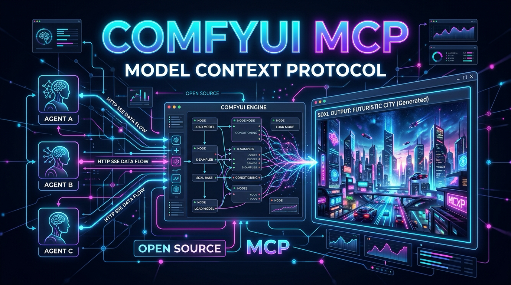

<p align="center">
  
</p>

[English](README.en.md) · **Español**

# ComfyUI MCP — Generación de imágenes para agentes IA vía Model Context Protocol (MCP)

> **Conecta la generación de imágenes SDXL a cualquier agente IA en tu red.**
> Servidor MCP open source que expone inferencia de ComfyUI (SDXL / RTX 3060) a Claude Code, Cursor, Windsurf, Hermes Gateway y cualquier cliente compatible con [Model Context Protocol](https://modelcontextprotocol.io). FastMCP HTTP/SSE + GPU Arbiter, **cero dependencias en clientes, 100% en tu hardware**.

[](LICENSE)
[](https://modelcontextprotocol.io)
[](pyproject.toml)
[](https://github.com/GermaniU/comfyui-mcp/actions/workflows/ci.yml)
[](https://github.com/jlowin/fastmcp)
[](CONTRIBUTING.md)

**Tags:** `mcp-server` · `comfyui` · `sdxl` · `image-generation` · `ai-agents` · `fastmcp` · `claude-code` · `cursor` · `hermes-gateway` · `gpu-arbiter` · `local-first` · `self-hosted`

---

## 💡 Por qué existe

Generar imágenes en entornos multi-agente requiere instalar bibliotecas pesadas de PyTorch, GPUs dedicadas y configuraciones complejas en cada máquina cliente. **ComfyUI MCP** resuelve esto actuando como un adaptador middleware HTTP/SSE desacoplado:

- 🚀 **Cero Instalación Local**: Cualquier cliente o gateway consumirá la generación de imágenes vía HTTP/SSE en puerto `8201` sin instalar PyTorch ni bajar modelos SDXL localmente.
- 🧠 **GPU Arbiter Inteligente**: Alterna automáticamente entre `llama-server` (LLMs) y `ComfyUI` en GPUs de 12GB (RTX 3060) sin colisiones de VRAM.
- 🎯 **Presets Profesionales**: Generación lista para producción con presets como `producto` (RealVisXL V4.0) o `realista` (Juggernaut XL).

---

## 🏗️ Arquitectura y Deslinde de Componentes

> ⚠️ **IMPORTANTE: Entender los Límites del Sistema**
>
> `comfyui-mcp` es **únicamente la capa de transporte e interfaz MCP**. No incluye el motor de inferencia de ComfyUI ni los archivos de peso de modelos.
> Para la guía de despliegue del servidor backend en el host Linux/Pop!_OS, consulta [docs/SERVER_SETUP.md](docs/SERVER_SETUP.md) y [docs/ARCHITECTURE.md](docs/ARCHITECTURE.md).

```
 +-------------------------------------------------------+
 |                 Clientes MCP (LAN)                    |
 | (Claude Code CLI / Cursor / Windsurf / Hermes Gateway)|
 +-------------------------------------------------------+
                             |
                             | HTTP / SSE (Puerto 8201)
                             v
 +-------------------------------------------------------+
 |                  comfyui-mcp Server                   |
 |           (FastMCP + Workflow JSON Builder)           |
 +-------------------------------------------------------+
                             |
                             | Loopback HTTP (Puerto 8188)
                             v
 +-------------------------------------------------------+
 |                 ComfyUI Backend Host                  |
 |  (PyTorch + CUDA + SDXL Checkpoints + GPU Arbiter)    |
 +-------------------------------------------------------+
```

---

## 📦 Instalación Rápida

### Requisitos
- Python 3.11+
- `uv` (recomendado) o `pip`

### Clonar e Instalar

```bash
git clone https://github.com/GermaniU/comfyui-mcp.git
cd comfyui-mcp

# Crear entorno virtual e instalar
uv venv
source .venv/bin/activate
uv pip install -e .
```

---

## ⚙️ Configuración (Variables de Entorno)

Crea un archivo `.env` o exporta las siguientes variables:

| Variable | Valor por Defecto | Descripción |
|----------|-------------------|-------------|
| `COMFYUI_URL` | `http://127.0.0.1:8188` | URL loopback donde escucha el motor de ComfyUI. |
| `COMFYUI_PUBLIC_URL` | `http://<YOUR_SERVER_IP>:8188` | Base URL pública/LAN para descarga de imágenes. |
| `MCP_HOST` | `0.0.0.0` | Host binding para el servidor MCP. |
| `MCP_PORT` | `8201` | Puerto HTTP/SSE del servidor MCP. |
| `MCP_AUTH_TOKEN` | *(vacío = sin auth)* | Si se define, exige header `Authorization: Bearer <token>` en cada request HTTP/SSE. |

---

## 🛠️ Herramientas Expuestas (Tool Reference)

### 1. `generate_image` (txt2img)
Genera una imagen desde un prompt textual usando SDXL.

- **Parámetros**:
  - `prompt` (*string*, requerido): Descripción detallada de la imagen a generar.
  - `negative_prompt` (*string*, opcional): Elementos a excluir. Default: `"ugly, blurry, low quality, distorted"`.
  - `preset` (*string*, opcional): Preset predefinido (`producto`, `realista`, `rapido`, `anime`). Default: `"realista"`.
  - `aspect_ratio` (*string*, opcional): Relación de aspecto (`1:1`, `16:9`, `9:16`, `4:3`, `3:4`). Default: `"1:1"`.
  - `seed` (*integer*, opcional): Semilla para reproducibilidad (-1 para aleatoria). Default: `-1`.
  - `steps` (*integer*, opcional): Pasos del sampler (sobreescribe preset si se especifica).
  - `cfg` (*float*, opcional): CFG scale.

### 2. `img2img` (Image-to-Image)
Transforma una imagen existente aplicando un nuevo prompt y nivel de denoise.

- **Parámetros**:
  - `image_source` (*string*, requerido): URL pública o cadena Base64 de la imagen de entrada.
  - `prompt` (*string*, requerido): Instrucción de transformación.
  - `denoise` (*float*, opcional): Intensidad de cambio (`0.1` a `1.0`). Default: `0.7`.
  - `preset` (*string*, opcional): Preset de checkpoint/sampler. Default: `"realista"`.

### 3. `list_models`
Retorna la lista de checkpoints, LoRAs y samplers disponibles en la instancia de ComfyUI.

### 4. `comfy_health`
Obtiene el estado de salud del backend: versión de ComfyUI, uso de VRAM de la GPU y tareas en cola.

### 5. `comfy_view_url`
Construye la URL LAN de descarga directa para un archivo generado previamente dado su `filename` y `subfolder`.

---

## 🎨 Matriz de Presets

| Preset | Checkpoint Asociado | Pasos | CFG | Caso de Uso |
|--------|---------------------|-------|-----|-------------|
| `producto` | `RealVisXL_V4.0.safetensors` | 30 | 7.0 | Fotografía comercial y de producto fotorrealista. |
| `realista` | `juggernautXL_ragnarokBy.safetensors` | 30 | 7.0 | Fotorrealismo versátil de alta calidad (Default). |
| `rapido` | `juggernautXL_ragnarokBy.safetensors` | 6 | 2.0 | Vista previa y borradores en ~5 segundos. |
| `anime` | `animagine-xl-3.1.safetensors` | 28 | 7.0 | Ilustración digital y estilo anime. |

---

## 🔗 Integración con Clientes MCP

### Configuración para Claude Code CLI (`~/.claude.json`)

```json
{
  "mcpServers": {
    "comfyui": {
      "url": "http://<YOUR_SERVER_IP>:8201/mcp"
    }
  }
}
```

### Configuración para Hermes Gateway (`~/.hermes/config.yaml`)

```yaml
mcp_servers:
  comfyui:
    url: "http://<YOUR_SERVER_IP>:8201/mcp"
    transport: "http"
```

### Configuración para Cursor / Windsurf / Claude Desktop

Añade un servidor MCP de tipo **SSE / HTTP** con la URL `http://<LAN_IP>:8201/mcp`.

---

## 📋 Componentes Faltantes y Roadmap (Server Gaps)

Dado que este repo representa la **capa MCP**, los siguientes elementos están fuera de este repositorio y deben configurarse en el servidor host:

1. **Servidor Backend ComfyUI**: Requiere instalación independiente de Python + PyTorch CUDA.
2. **Descarga de Checkpoints**: Los modelos SDXL deben descargarse manualmente en el directorio `models/checkpoints/` del servidor ComfyUI.
3. **GPU Arbiter Script**: El script `gpu-broker.sh` y las reglas `/etc/sudoers.d/gpu-arbiter` deben residir en la máquina Linux con la GPU.
4. **Futuras Mejoras del MCP**:
   - Soporte para inyección de workflows JSON personalizados dinámicos.
   - Cancelación y limpieza de colas de procesamiento vía tool MCP.
   - Conexión por WebSocket para reporte de progreso en tiempo real.

---

## 🧪 Pruebas Unitarias

```bash
uv run --with pytest --with pytest-asyncio pytest
```

---

## 📄 Licencia

Este proyecto está bajo la Licencia MIT. Consulta el archivo [LICENSE](LICENSE) para más detalles.
